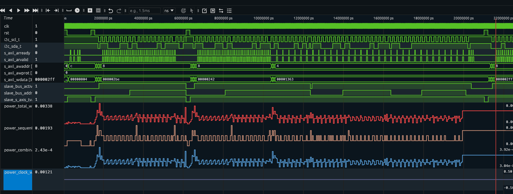

# Power sweep over a VCD (OpenSTA / Librelane)

Slices a large VCD into time windows, runs OpenSTA's `report_power` on
each window (via a Librelane Docker image), and plots the estimated
power (Total / Sequential / Combinational / Clock) as it evolves over
the simulation.



## Files

| File | What it does |
|---|---|
| `vcd_extract.py` | Extracts a single `[start, end]` time window from a large VCD into a standalone file. Streams through the source file — never loads it all into memory. |
| `parse_power_report.py` | Parses the `report_power` table out of an OpenSTA log, prints the values as CSV or JSON. |
| `sweep_power.sh` | Runs the whole sweep (extract → OpenSTA → parse) window by window, sequentially, and produces `power_sweep.csv`. |
| `sweep_power_parallel.sh` | Same as above, but runs several windows at once (one `run_power_script.sh` execution per core). See [Parallel execution](#parallel-execution-sweep_power_parallelsh) below. |
| `plot_power_sweep.py` | Reads `power_sweep.csv` and builds an interactive HTML bar chart (Total + the three groups). |
| `annotate_vcd_power.py` | Writes a *copy* of the source VCD with 4 extra real-valued signals (`power_total_w`, `power_sequential_w`, `power_combinational_w`, `power_clock_w`) so you can see the power curve next to the original waveforms in GTKWave/Surfer. |
| `power_vcd.tcl` | The OpenSTA script that actually computes `report_power`. Project-specific — see [Configuring power_vcd.tcl](#configuring-power_vcdtcl). |
| `run_power_script.sh` | Launches the Librelane Docker container and runs `power_vcd.tcl` inside it. |

## Requirements

- **Docker**, with a Librelane image already built/pulled locally (image
  name must contain `librelane`; `run_power_script.sh` picks it up
  automatically via `docker images | grep librelane`).
- **Python 3** (3.8+), no third-party packages needed for
  `vcd_extract.py`, `parse_power_report.py` or `annotate_vcd_power.py`
  (standard library only).
- **Plotly**, only for `plot_power_sweep.py`:
  ```bash
  pip install plotly
  ```
- **Bash** with the usual GNU userland (`find`, `xargs`, `mkfifo`,
  `flock`-free FIFO semaphore) — standard on any Linux box. On macOS the
  stock Bash/coreutils are old enough to cause issues; install a recent
  Bash and GNU coreutils via Homebrew if you're not on Linux.
- Optional: **GTKWave** or **Surfer** to view the VCDs (including the
  ones annotated by `annotate_vcd_power.py`).

## Project layout expected by the scripts

`sweep_power.sh` / `sweep_power_parallel.sh` expect a **project
directory** (`--workdir`) containing everything `run_power_script.sh`
needs to run OpenSTA:

```
my_project/
├── power_vcd.tcl          # OpenSTA script (see below)
├── run_power_script.sh    # launches the Docker container
├── design.lib              # Liberty
├── design.v                 # gate-level netlist
├── design.sdc                # timing constraints
├── design.spef                 # parasitics
└── dump.vcd                     # OVERWRITTEN on every iteration by the sweep — don't put anything important here
```

`power_vcd.tcl` always reads a **fixed** filename, `dump.vcd`, from the
current directory — that's why the sweep scripts always write the
window being processed to `<workdir>/dump.vcd` before invoking OpenSTA.

## Configuring `power_vcd.tcl`

This is the actual OpenSTA script and it's project-specific — you'll
need to point it at your own design files. Example:

```tcl
read_liberty sky130_fd_sc_hd__tt_025C_1v80.lib
read_verilog i2c_master_axil_nl_refactored.v
link_design i2c_master_axil
read_sdc i2c_master_axil.sdc
read_spef i2c_master_axil_nom_refactored.spef
read_vcd -scope i2c_netlist_wrapper/i2c_master_inst dump.vcd
report_power
exit
```

What to change for your own design:

- `read_liberty` — path to your Liberty (`.lib`) file(s). Add one
  `read_liberty` line per corner/library you need.
- `read_verilog` — your gate-level netlist.
- `link_design <top>` — the top-level module name to link (must match
  a module in the netlist).
- `read_sdc` — your timing constraints file.
- `read_spef` — your parasitics file. Skip this line if you don't have
  a SPEF (power numbers will be less accurate, but it still runs).
- `read_vcd -scope <hierarchical path> dump.vcd` — **this is the part
  most likely to need changing**. `-scope` must point at the VCD scope
  that corresponds to the design instance you linked with
  `link_design`, so OpenSTA can match VCD signals to the netlist. If
  your testbench wraps the DUT in a different hierarchy, this path
  needs to reflect that (check with `vcd_extract.py your.vcd --info`
  and/or `$scope` lines in the VCD header if you're unsure of the
  path).
- `dump.vcd` itself is never renamed — leave it exactly as `dump.vcd`;
  the sweep scripts rely on that fixed name.
- `report_power` — leave as is; this is what `parse_power_report.py`
  parses. Don't add extra `-instance`/`-hierarchical` flags unless you
  also update the regexes in `parse_power_report.py` to match the
  resulting table format.

`run_power_script.sh` itself usually doesn't need edits — it just finds
your local Librelane image and runs `sta power_vcd.tcl` inside it,
mounting the current directory as `/openlane`:

```bash
IMAGE_NAME=$(docker images --format "{{.Repository}}:{{.Tag}}" | grep "librelane" | head -n 1)

if [ -z "$IMAGE_NAME" ]; then
    echo "Error: Librelane image not found!"
    exit 1
fi

docker run --rm -v $(pwd):/openlane -w /openlane "$IMAGE_NAME" sta power_vcd.tcl
```

## Usage

### 1. Check your source VCD before slicing

```bash
python3 vcd_extract.py dump_original.vcd --info
```

Shows `$timescale`, the real `[min, max]` time range in the file, and
how many signals/events it found. Use this to pick sane `--start`,
`--window` and `--steps` values before running a full sweep.

### 2. Run the sweep

Sequential (simple, one window at a time):

```bash
./sweep_power.sh \
    --vcd dump_original.vcd \
    --workdir ./calculation/ \
    --start 0 --window 50000 --steps 400
```

Parallel (recommended for a large number of windows — see
[Parallel execution](#parallel-execution-sweep_power_parallelsh)):

```bash
./sweep_power_parallel.sh \
    --vcd dump_original.vcd \
    --workdir ./calculation/ \
    --start 0 --window 50000 --steps 400 \
    --jobs 6 --shift-to-zero
```

Both produce `power_sweep_results/power_sweep.csv` (configurable via
`--out-dir`), plus per-window logs under `power_sweep_results/logs/`.

Useful flags on both scripts:

- `--window-step N` — how far the window start advances each
  iteration. Defaults to `--window` (consecutive, non-overlapping
  windows). Use something smaller to overlap windows, or larger to
  leave gaps.
- `--keep-vcds` — also save each per-window `dump.vcd` under
  `out-dir/vcds/`.
- `--shift-to-zero` — re-anchors each extracted window's timestamps to
  start at `#0` instead of keeping the absolute time from the source
  VCD. Mainly useful to sanity-check that OpenSTA's power estimate
  doesn't depend on the absolute timestamp value (it shouldn't — the
  calculation is toggle-rate/duty-cycle based — but it's a cheap way to
  confirm that on your own setup if a result looks off).

`sweep_power_parallel.sh`-only flags:

- `--jobs N` — how many windows to process at once (default:
  `nproc`). OpenSTA itself still runs single-threaded inside each run;
  this just controls how many `run_power_script.sh` instances run
  simultaneously.
- `--copy-workdir` — do a full copy of `--workdir` into each parallel
  slot instead of hardlinking the input files. Slower and uses more
  disk, but needed if `--workdir` is read-only or on a different
  filesystem than where the slots get created.

### 3. Plot the results

```bash
python3 plot_power_sweep.py power_sweep_results/power_sweep.csv
```

Generates a self-contained interactive `.html` file (grouped bar chart,
Total vs. Sequential/Combinational/Clock) — open it in any browser, no
server needed. Useful flags: `--x-axis {end,duration,index}`,
`--timescale "1 ps"` (to label the X axis in ns instead of raw VCD
ticks), `--y-min`/`--y-max`, `--autoscale-skip N`.

### 4. (optional) Annotate the source VCD with the power curve

```bash
python3 annotate_vcd_power.py dump_original.vcd power_sweep_results/power_sweep.csv \
    --out-dir power_sweep_results
```

Writes a copy of `dump_original.vcd` into `power_sweep_results/` with 4
extra real-valued signals (grouped under a `power_sweep` scope) that
step to a new value at each window boundary — total/sequential/
combinational/clock power, straight from the CSV, in floating point.
Open that copy in GTKWave/Surfer to see the power curve lined up
against the original signals. The source VCD passed as the first
argument is never modified — the script always copies it into
`--out-dir` first and only edits that copy.

## Parallel execution (`sweep_power_parallel.sh`)

`power_vcd.tcl` always reads a fixed `dump.vcd` from the current
directory, and `run_power_script.sh` mounts the current directory as
`/openlane` inside the Docker container — meaning the container only
sees files that live inside that mounted directory. Two consequences:

1. Two workers can't share the same `--workdir` at once (they'd
   overwrite each other's `dump.vcd` mid-run).
2. You can't just symlink a worker's directory back to the original
   `--workdir` — a symlink pointing outside the mounted directory is
   invisible to the container.

So `sweep_power_parallel.sh` builds one self-contained directory per
parallel "slot" (`<workdir>/.sweep_parallel_workers/slot_N/`), built
once and reused across windows:

- `power_vcd.tcl`, `run_power_script.sh`, `.lib`, `.v`, `.sdc`, `.spef`
  go in as **read-only hardlinks** (same data on disk, zero
  duplication, but the container sees them as regular files).
- Any subdirectories in `--workdir` are **copied for real** (no
  hardlinks for directories, and a symlink would have the same
  container-visibility problem).
- `dump.vcd` is generated fresh per slot per window — never shared.

Hardlinking requires the slots and the source files to be on the same
filesystem, which is why the slot directories live under `--workdir`
and not `--out-dir`. Pass `--copy-workdir` if that's not possible in
your setup.

## `power_sweep.csv` columns

```
index,start,end,duration,events,internal_power_w,switching_power_w,leakage_power_w,total_power_w,sequential_power_w,combinational_power_w,clock_power_w
```

- `index`, `start`, `end`, `duration` — window metadata, in raw VCD
  time units.
- `events` — number of value-change events `vcd_extract.py` wrote for
  that window (a rough activity indicator).
- `internal_power_w`, `switching_power_w`, `leakage_power_w`,
  `total_power_w` — the overall `Total` row from `report_power`.
- `sequential_power_w`, `combinational_power_w`, `clock_power_w` — the
  `Total Power` column from the `Sequential`/`Combinational`/`Clock`
  group rows specifically.

## Troubleshooting

- **A window is missing from the CSV / a warning about a skipped
  window**: check `power_sweep_results/logs/power_<index>.log` — that's
  the raw OpenSTA output for that window. A missing `Total` row usually
  means a fatal error reading the liberty/verilog/sdc/spef file, not a
  power-calculation issue.
- **`sequential_power_w`/`combinational_power_w`/`clock_power_w` came
  back as `0.0` with a stderr warning about a missing group row**:
  `report_power`'s table layout didn't match what
  `parse_power_report.py` expects (different group name, extra
  columns, etc.) — open the raw log and compare against the expected
  format in `parse_power_report.py`'s docstring.
- **Values in the chart look surprisingly low for some windows**: check
  whether a legend series got isolated by a double-click in the Plotly
  chart before assuming it's a real drop in activity — double-click
  the isolated series again to bring the others back.